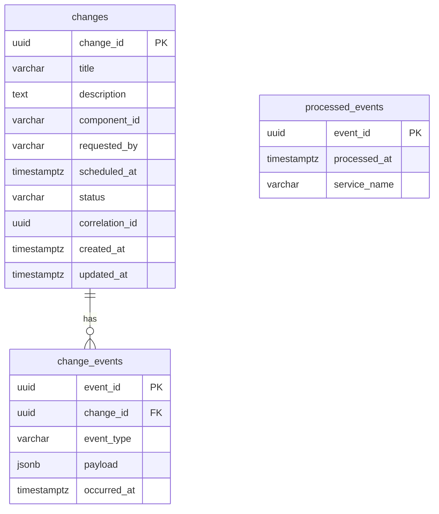

# ChangeOps Dashboard — Projeto Completo

> Gerado por: Arquiteto de Software Sênior  
> Stack: Java 17 + Spring Boot · React + TypeScript · Kafka · PostgreSQL · Docker Compose  
> Total de arquivos gerados: **102**

---

## Índice

1. [Repositório Backend — change-service](#1-repositório-backend--change-service)
2. [Repositório Backend — deploy-orchestrator](#2-repositório-backend--deploy-orchestrator)
3. [Repositório Frontend](#3-repositório-frontend)
4. [Contratos (OpenAPI + AsyncAPI)](#4-contratos)
5. [Modelo de Dados e Persistência](#5-modelo-de-dados-e-persistência)
6. [Segurança](#6-segurança)
7. [Observabilidade](#7-observabilidade)
8. [Automação (Docker Compose + Makefile + CI/CD)](#8-automação)
9. [Roadmap Técnico](#9-roadmap-técnico)

---

## 1. Repositório Backend — change-service

### Visão Geral

Serviço responsável pelo **Fluxo 1** completo: recebimento da requisição HTTP, validação de domínio (hexagonal), persistência e publicação do `ChangePreparedEvent` no Kafka com envelope de integração.

**Padrão arquitetural:** Hexagonal (Ports & Adapters)

```
change-service/
├── api/
│   ├── controller/       ChangeController, GlobalExceptionHandler
│   └── dto/              CreateChangeRequest/Response, ChangeDto, ChangeEventDto
├── application/
│   ├── port/in/          CreateChangeUseCase, ListChangesUseCase, GetChangeEventsUseCase
│   ├── port/out/         SaveChangePort, LoadChangesPort, PublishEventPort, SaveChangeEventPort
│   └── service/          CreateChangeService, ListChangesService, GetChangeEventsService
├── domain/
│   ├── model/            Change (Aggregate Root)
│   ├── event/            ChangePreparedEvent (domínio)
│   ├── exception/        ChangeNotFoundException, InvalidChangeStateException
│   └── valueobject/      ChangeStatus
└── infrastructure/
    ├── config/           KafkaConfig
    ├── kafka/            KafkaEventPublisherAdapter, IntegrationEvent (envelope)
    ├── observability/    CorrelationIdFilter (MDC)
    ├── persistence/      ChangePersistenceAdapter, ChangeEntity, ChangeEventEntity
    └── security/         SecurityConfig, CustomJwtAuthenticationConverter
```

### pom.xml

```xml
<?xml version="1.0" encoding="UTF-8"?>
<project xmlns="http://maven.apache.org/POM/4.0.0" ...>
  <parent>
    <groupId>org.springframework.boot</groupId>
    <artifactId>spring-boot-starter-parent</artifactId>
    <version>3.2.3</version>
  </parent>
  <groupId>com.changeops</groupId>
  <artifactId>change-service</artifactId>
  <version>1.0.0-SNAPSHOT</version>
  <properties>
    <java.version>17</java.version>
    <mapstruct.version>1.5.5.Final</mapstruct.version>
    <testcontainers.version>1.19.6</testcontainers.version>
  </properties>
  <!-- spring-boot-starter-web, validation, data-jpa, actuator, security -->
  <!-- spring-boot-starter-oauth2-resource-server -->
  <!-- spring-kafka, postgresql, flyway-core -->
  <!-- micrometer-registry-prometheus, logstash-logback-encoder:7.4 -->
  <!-- mapstruct, lombok, springdoc-openapi-starter-webmvc-ui:2.3.0 -->
  <!-- test: spring-boot-starter-test, spring-kafka-test, testcontainers -->
</project>
```

### Domínio

#### `Change` — Aggregate Root

```java
// domain/model/Change.java
public class Change {
    private final UUID changeId;
    private final String title, description, componentId, requestedBy;
    private final Instant scheduledAt;
    private ChangeStatus status;         // DRAFT → PREPARED → COMPLETED/FAILED
    private final UUID correlationId;    // UUID v4, gerado na criação
    private final Instant createdAt;
    private Instant updatedAt;
    private final List<Object> domainEvents = new ArrayList<>();

    public static Change create(String title, String description,
                                String componentId, String requestedBy,
                                Instant scheduledAt) {
        // Gera changeId, correlationId, define status=PREPARED
        // Adiciona ChangePreparedEvent à lista de domainEvents
    }

    public void complete() { /* PREPARED → COMPLETED */ }
    public void fail()     { /* PREPARED → FAILED    */ }
    public List<Object> pullDomainEvents() { /* drains list */ }
}
```

#### `ChangePreparedEvent` — Domain Event

```java
public record ChangePreparedEvent(
    UUID changeId, String componentId, String requestedBy,
    Instant scheduledAt, UUID correlationId, Instant occurredAt
) {}
```

#### `ChangeStatus` — Value Object

```java
public enum ChangeStatus { DRAFT, PREPARED, COMPLETED, FAILED, CANCELLED }
```

### Application Layer — Use Cases

```java
// port/in/CreateChangeUseCase.java
public interface CreateChangeUseCase {
    Result execute(Command command);
    record Command(String title, String description, String componentId,
                   String requestedBy, Instant scheduledAt) {}
    record Result(UUID changeId, String status, UUID correlationId, Instant createdAt) {}
}

// port/in/ListChangesUseCase.java
public interface ListChangesUseCase {
    Page<Result> execute(Query query, Pageable pageable);
    record Query(ChangeStatus status, String componentId) {}
    record Result(UUID changeId, String title, String componentId, String status,
                  UUID correlationId, Instant createdAt, Instant updatedAt) {}
}

// port/in/GetChangeEventsUseCase.java
public interface GetChangeEventsUseCase {
    List<Result> execute(UUID changeId);
    record Result(UUID eventId, UUID changeId, String eventType,
                  String payload, Instant occurredAt) {}
}
```

```java
// port/out/ interfaces
public interface SaveChangePort    { Change save(Change change); }
public interface LoadChangesPort   { Optional<Change> findById(UUID id);
                                     Page<Change> findAll(ChangeStatus, String, Pageable); }
public interface PublishEventPort  { void publish(Object domainEvent); }
public interface SaveChangeEventPort { void save(UUID changeId, String type,
                                                  String payload, Instant at); }
```

### CreateChangeService

```java
@Slf4j @Service
public class CreateChangeService implements CreateChangeUseCase {

    @Override
    @Transactional
    public Result execute(Command command) {
        Change change = Change.create(command.title(), command.description(),
                command.componentId(), command.requestedBy(), command.scheduledAt());

        Change saved = saveChangePort.save(change);

        saved.pullDomainEvents().forEach(event -> {
            publishEventPort.publish(event);          // → Kafka
            saveChangeEventPort.save(...);            // → timeline store
        });

        changesCreatedCounter.increment();            // Prometheus
        log.info("Change created: changeId={}, correlationId={}",
                 saved.getChangeId(), saved.getCorrelationId());

        return new Result(saved.getChangeId(), saved.getStatus().name(),
                          saved.getCorrelationId(), saved.getCreatedAt());
    }
}
```

### Infrastructure — Kafka

#### `IntegrationEvent` — Envelope externo

```java
// infrastructure/kafka/IntegrationEvent.java
@Builder
public record IntegrationEvent(
    String eventType,   // "ChangePreparedEvent"
    String version,     // "1.0"
    UUID correlationId,
    Instant occurredAt,
    Object payload
) {}
```

#### `KafkaEventPublisherAdapter`

```java
@Component
public class KafkaEventPublisherAdapter implements PublishEventPort {

    @Override
    public void publish(Object domainEvent) {
        if (domainEvent instanceof ChangePreparedEvent event) {
            IntegrationEvent envelope = IntegrationEvent.builder()
                .eventType("ChangePreparedEvent").version("1.0")
                .correlationId(event.correlationId())
                .occurredAt(Instant.now())
                .payload(new ChangePreparedPayload(event.changeId(),
                         event.componentId(), event.requestedBy(), event.scheduledAt()))
                .build();

            kafkaTemplate.send(changePreparedTopic, event.changeId().toString(), envelope)
                .whenComplete((result, ex) -> {
                    if (ex != null) log.error("Failed to publish: correlationId={}", ...);
                    else            eventsPublishedCounter.increment();
                });
        }
    }
}
```

### Infrastructure — Persistência

#### `ChangePersistenceAdapter`

```java
@Component
public class ChangePersistenceAdapter
        implements SaveChangePort, LoadChangesPort, SaveChangeEventPort {

    @Override
    public Change save(Change change) {
        return toDomain(changeJpaRepository.save(toEntity(change)));
    }

    @Override
    public Page<Change> findAll(ChangeStatus status, String componentId, Pageable p) {
        return changeJpaRepository.findAllFiltered(status, componentId, p)
                                  .map(this::toDomain);
    }

    @Override
    public void save(UUID changeId, String type, String payload, Instant at) {
        changeEventJpaRepository.save(ChangeEventEntity.builder()
            .eventId(UUID.randomUUID()).changeId(changeId)
            .eventType(type).payload(payload).occurredAt(at).build());
    }
}
```

#### `ChangeJpaRepository`

```java
public interface ChangeJpaRepository extends JpaRepository<ChangeEntity, UUID> {
    @Query("""
        SELECT c FROM ChangeEntity c
        WHERE (:status IS NULL OR c.status = :status)
          AND (:componentId IS NULL OR c.componentId = :componentId)
        ORDER BY c.createdAt DESC
        """)
    Page<ChangeEntity> findAllFiltered(
        @Param("status") ChangeStatus status,
        @Param("componentId") String componentId,
        Pageable pageable);
}
```

### API Layer

#### `ChangeController`

```java
@RestController
@RequestMapping("/api/v1/changes")
public class ChangeController {

    @PostMapping
    public ResponseEntity<CreateChangeResponse> create(
            @Valid @RequestBody CreateChangeRequest request,
            @RequestHeader(value = "X-User-Id", required = false) String userId,
            @AuthenticationPrincipal Jwt jwt) {

        CreateChangeUseCase.Result result = createChangeUseCase.execute(
            new CreateChangeUseCase.Command(
                request.title(), request.description(), request.componentId(),
                resolveRequestedBy(userId, jwt, request.requestedBy()),
                request.scheduledAt()));

        URI location = ServletUriComponentsBuilder.fromCurrentRequest()
            .path("/{id}").buildAndExpand(result.changeId()).toUri();

        return ResponseEntity.created(location)
            .body(new CreateChangeResponse(result.changeId(), result.status(),
                                           result.correlationId(), result.createdAt()));
    }

    @GetMapping
    public ResponseEntity<Page<ChangeDto>> list(
            @RequestParam(required = false) ChangeStatus status,
            @RequestParam(required = false) String componentId,
            @PageableDefault(size = 20, sort = "createdAt") Pageable pageable) { ... }

    @GetMapping("/{changeId}/events")
    public ResponseEntity<List<ChangeEventDto>> getEvents(@PathVariable UUID changeId) { ... }
}
```

#### `CreateChangeRequest` — Validações

```java
public record CreateChangeRequest(
    @NotBlank(message = "title is required")
    @Size(max = 255)
    String title,

    @Size(max = 2000)
    String description,

    @NotBlank(message = "componentId is required")
    String componentId,

    @NotBlank(message = "requestedBy is required")
    String requestedBy,

    @NotNull(message = "scheduledAt is required")
    @Future(message = "scheduledAt must be a future date")
    Instant scheduledAt
) {}
```

#### `GlobalExceptionHandler` — RFC 7807 Problem Details

```java
@RestControllerAdvice
public class GlobalExceptionHandler {

    @ExceptionHandler(MethodArgumentNotValidException.class)
    public ProblemDetail handleValidation(MethodArgumentNotValidException ex) {
        Map<String, String> fields = ex.getBindingResult().getFieldErrors().stream()
            .collect(toMap(FieldError::getField, FieldError::getDefaultMessage));
        ProblemDetail pd = ProblemDetail.forStatusAndDetail(BAD_REQUEST, "Validation failed");
        pd.setProperty("fields", fields);
        return pd;
    }

    @ExceptionHandler(ChangeNotFoundException.class)
    public ProblemDetail handleNotFound(ChangeNotFoundException ex) { ... }
}
```

### Segurança

```java
@Configuration @EnableWebSecurity
public class SecurityConfig {

    @Bean
    public SecurityFilterChain filterChain(HttpSecurity http) throws Exception {
        return http
            .csrf(AbstractHttpConfigurer::disable)
            .cors(cors -> cors.configurationSource(corsConfigurationSource()))
            .sessionManagement(s -> s.sessionCreationPolicy(STATELESS))
            .authorizeHttpRequests(auth -> auth
                .requestMatchers("/actuator/health", "/actuator/prometheus").permitAll()
                .requestMatchers("/swagger-ui/**", "/v3/api-docs/**").permitAll()
                .requestMatchers(HttpMethod.GET, "/api/v1/changes/**").hasAnyRole("OPERATOR","ADMIN")
                .requestMatchers(HttpMethod.POST, "/api/v1/changes").hasAnyRole("OPERATOR","ADMIN")
                .anyRequest().authenticated())
            .oauth2ResourceServer(oauth2 -> oauth2.jwt(
                jwt -> jwt.jwtAuthenticationConverter(new CustomJwtAuthenticationConverter())))
            .build();
    }
}
```

### Observabilidade — CorrelationIdFilter

```java
@Component @Order(1)
public class CorrelationIdFilter implements Filter {
    @Override
    public void doFilter(ServletRequest req, ServletResponse res, FilterChain chain) {
        String correlationId = httpRequest.getHeader("X-Correlation-Id");
        if (correlationId == null) correlationId = UUID.randomUUID().toString();
        MDC.put("correlation_id", correlationId);
        MDC.put("service", "change-service");
        httpResponse.setHeader("X-Correlation-Id", correlationId);
        try { chain.doFilter(req, res); } finally { MDC.clear(); }
    }
}
```

### application.yml

```yaml
spring:
  application:
    name: change-service
  datasource:
    url: jdbc:postgresql://${DB_HOST:localhost}:${DB_PORT:5432}/${DB_NAME:changeops}
    username: ${DB_USER:changeops}
    password: ${DB_PASS:changeops}
  jpa:
    hibernate.ddl-auto: validate
  flyway:
    enabled: true
    locations: classpath:db/migration
  kafka:
    bootstrap-servers: ${KAFKA_BOOTSTRAP_SERVERS:localhost:9092}
  security.oauth2.resourceserver.jwt:
    issuer-uri: ${JWT_ISSUER_URI:http://localhost:8180/realms/changeops}

server.port: ${SERVER_PORT:8080}

management:
  endpoints.web.exposure.include: health,info,prometheus,metrics
  metrics.tags.application: ${spring.application.name}

changeops.kafka.topics.change-prepared: changeops.change.prepared
```

### Testes

#### `ChangeTest` — Unitário (domínio)

```java
class ChangeTest {
    @Test void create_shouldSetPreparedStatus_andGenerateCorrelationId() { ... }
    @Test void create_shouldRaiseDomainEvent() { ... }
    @Test void pullDomainEvents_shouldClearEventsAfterPull() { ... }
    @Test void complete_shouldTransitionToCompleted_whenPrepared() { ... }
    @Test void fail_shouldThrow_whenAlreadyFailed() { ... }
}
```

#### `CreateChangeIT` — Integração (Testcontainers)

```java
@SpringBootTest(webEnvironment = RANDOM_PORT)
@Testcontainers @ActiveProfiles("test")
class CreateChangeIT {
    @Container static PostgreSQLContainer<?> postgres = ...;
    @Container static KafkaContainer kafka = ...;

    @Test void shouldCreate_whenPayloadIsValid_thenReturn201AndPublishEvent() { ... }
    @Test void shouldReturn400_whenTitleIsMissing() { ... }
    @Test void shouldReturn400_whenComponentIdIsMissing() { ... }
    @Test void shouldListChanges_andReturnPaginatedResults() { ... }
}
```

---

## 2. Repositório Backend — deploy-orchestrator

### Visão Geral

Serviço responsável pelo **Fluxo 2** completo: consumo do `DeployFinishedEvent`, garantia de idempotência, checklist pós-deploy, atualização de status e publicação de `ChangeCompletedEvent` / `ChangeFailedEvent` com retry exponencial e DLQ.

```
deploy-orchestrator/
├── application/
│   ├── port/in/   ProcessDeployResultUseCase
│   ├── port/out/  IdempotencyPort, UpdateChangeStatusPort, PublishResultEventPort
│   └── service/   ProcessDeployResultService, PostDeployChecklistService
├── domain/
│   ├── event/     DeployFinishedEvent (consumed)
│   ├── model/     ChangeResult
│   └── exception/ InvalidOrchestratorStateException
└── infrastructure/
    ├── kafka/     DeployEventConsumer, KafkaResultPublisherAdapter,
    │              KafkaConfig, IntegrationEvent
    └── persistence/ IdempotencyAdapter, UpdateChangeStatusAdapter,
                     ProcessedEventEntity/Repository, ChangeStatusEntity/Repository
```

### `DeployFinishedEvent` — Consumed

```java
public record DeployFinishedEvent(
    String eventType, String version, UUID correlationId, Instant occurredAt,
    Payload payload
) {
    public record Payload(UUID deployId, UUID changeId, String result, Instant executedAt) {}
    public boolean isSuccess() { return "SUCCESS".equalsIgnoreCase(payload().result()); }
}
```

### `ProcessDeployResultService` — Orquestração

```java
@Slf4j @Service
public class ProcessDeployResultService implements ProcessDeployResultUseCase {

    @Override
    @Transactional
    public void execute(DeployFinishedEvent event) {
        var payload = event.payload();
        MDC.put("correlation_id", event.correlationId().toString());
        MDC.put("change_id",  payload.changeId().toString());
        MDC.put("deploy_id",  payload.deployId().toString());

        try {
            // 1. Idempotency check
            if (idempotencyPort.isAlreadyProcessed(payload.deployId())) {
                log.warn("Event already processed, discarding: deployId={}", payload.deployId());
                return;
            }

            // 2. Post-deploy checklist
            ChecklistResult checklist = checklistService.execute(
                payload.changeId(), payload.deployId(), event.isSuccess());

            // 3. Build result
            ChangeResult result = ChangeResult.from(payload.changeId(), payload.deployId(),
                event.correlationId(), event.isSuccess() && checklist.allPassed());

            // 4. Update change status
            if (result.isSuccess()) updateChangeStatusPort.markCompleted(payload.changeId());
            else                    updateChangeStatusPort.markFailed(payload.changeId());

            // 5. Mark event as processed (idempotency store)
            idempotencyPort.markAsProcessed(payload.deployId(), "deploy-orchestrator");

            // 6. Publish result event
            result.markFinished();
            publishResultEventPort.publish(result);

        } finally {
            MDC.remove("deploy_id"); MDC.remove("change_id");
        }
    }
}
```

### `DeployEventConsumer` — Kafka com Retry + DLQ

```java
@Component
public class DeployEventConsumer {

    @RetryableTopic(
        attempts = "4",
        backoff = @Backoff(delay = 500, multiplier = 2.0, maxDelay = 10_000),
        autoCreateTopics = "true",
        dltStrategy = DltStrategy.FAIL_ON_ERROR,
        dltTopicSuffix = "-dlt"
    )
    @KafkaListener(
        topics = "${changeops.kafka.topics.deploy-finished}",
        groupId = "${changeops.kafka.consumer.group-id}",
        containerFactory = "deployEventListenerContainerFactory"
    )
    public void onDeployFinished(ConsumerRecord<String, DeployFinishedEvent> record, ...) {
        processDeployResultUseCase.execute(record.value());
    }

    @KafkaListener(topics = "${changeops.kafka.topics.deploy-finished}-dlt", ...)
    public void onDlt(ConsumerRecord<String, DeployFinishedEvent> record) {
        log.error("Event sent to DLQ after max retries: deployId={}",
                  record.value().payload().deployId());
    }
}
```

### `IdempotencyAdapter`

```java
@Component
public class IdempotencyAdapter implements IdempotencyPort {

    @Override
    public boolean isAlreadyProcessed(UUID eventId) {
        return repository.existsById(eventId);
    }

    @Override
    public void markAsProcessed(UUID eventId, String serviceName) {
        try {
            repository.save(ProcessedEventEntity.builder()
                .eventId(eventId).processedAt(Instant.now())
                .serviceName(serviceName).build());
        } catch (DataIntegrityViolationException e) {
            // Race condition: another instance already processed — safe to ignore
            log.warn("Concurrent idempotency conflict for eventId={}", eventId);
        }
    }
}
```

### `PostDeployChecklistService` — Simulado / Extensível

```java
@Service
public class PostDeployChecklistService {
    public ChecklistResult execute(UUID changeId, UUID deployId, boolean deploySucceeded) {
        List<CheckItem> items = List.of(
            check("deploy-result-gate",    deploySucceeded, "Deploy result was FAILURE"),
            check("healthcheck",           deploySucceeded, "Service did not become healthy"),
            check("smoke-test",            deploySucceeded, "Smoke test failed post-deploy"),
            check("error-rate-threshold",  deploySucceeded, "Error rate exceeded threshold")
        );
        // Extend: call real health endpoints, Prometheus queries, external test runners
        return new ChecklistResult(items.stream().allMatch(CheckItem::passed), ...);
    }
}
```

### Testes

```java
class ProcessDeployResultServiceTest {
    @Test void shouldMarkCompleted_andPublishEvent_whenDeploySucceeds() { ... }
    @Test void shouldMarkFailed_andPublishEvent_whenDeployFails() { ... }
    @Test void shouldDiscardEvent_whenDeployIdAlreadyProcessed() { ... }
    @Test void shouldNotMarkCompleted_whenSameEventDeliveredTwice() { ... }
}
```

---

## 3. Repositório Frontend

### Stack

- **React 18** + **TypeScript 5**
- **Vite** (build + dev server)
- **Zustand** (estado global)
- **Axios** (HTTP client com interceptors)
- **date-fns** (formatação de datas)
- **Vitest** + **Testing Library** (testes)

### Estrutura

```
frontend/src/
├── features/changes/
│   ├── types/       index.ts  (Change, ChangeEvent, PageResponse, ApiError)
│   ├── services/    changeService.ts  (create, list, getEvents)
│   ├── store/       useChangesStore.ts  (Zustand)
│   ├── hooks/       useChanges.ts, useCreateChange.ts, useChangeEvents.ts
│   └── components/  ChangeForm, ChangeList, ChangeTimeline
├── shared/
│   ├── components/  StatusBadge
│   ├── hooks/       usePolling.ts
│   └── lib/         http.ts (axios), test-setup.ts
└── app/
    └── routes/      ChangesPage.tsx (main page)
```

### `changeService.ts`

```typescript
const changeService = {
  async create(payload: CreateChangePayload): Promise<CreateChangeResponse> {
    const { data } = await http.post<CreateChangeResponse>('/changes', payload)
    return data
  },
  async list(params: ListChangesParams = {}): Promise<PageResponse<Change>> {
    const { data } = await http.get<PageResponse<Change>>('/changes', { params })
    return data
  },
  async getEvents(changeId: string): Promise<ChangeEvent[]> {
    const { data } = await http.get<ChangeEvent[]>(`/changes/${changeId}/events`)
    return data
  },
}
```

### `useChangesStore.ts` — Zustand

```typescript
export const useChangesStore = create<ChangesState>((set) => ({
  page: null,
  selectedChangeId: null,
  isPolling: false,
  setPage: (page) => set({ page }),
  setSelectedChangeId: (id) => set({ selectedChangeId: id }),
  upsertChange: (change) => set((state) => {
    if (!state.page) return {}
    const content = state.page.content.map(c =>
      c.changeId === change.changeId ? change : c)
    return { page: { ...state.page, content } }
  }),
}))
```

### `usePolling.ts`

```typescript
export function usePolling(
  callback: () => void | Promise<void>,
  { interval = 5_000, enabled = true }: UsePollingOptions = {}
) {
  // Schedules callback on a self-rescheduling setTimeout
  // Cleans up on unmount; runs after first interval (background refresh)
}
```

### `useChanges.ts` — Lista com Polling

```typescript
export function useChanges(params: ListChangesParams = {}) {
  const { page, setPage } = useChangesStore()
  const [loading, setLoading] = useState(false)
  const [pollError, setPollError] = useState(false)

  const fetch = useCallback(async () => { ... }, [])

  // Initial load (with spinner)
  const load = useCallback(async () => { setLoading(true); await fetch(); setLoading(false) }, [])

  // Background polling every 5 s (silent refresh, no spinner)
  usePolling(fetch, { interval: 5_000, enabled: !!page })

  return { changes: page?.content ?? [], page, loading, error, pollError, load }
}
```

### `ChangeForm.tsx` — Formulário com Validação Dupla

```typescript
export function ChangeForm({ onSuccess }: Props) {
  const [form, setForm] = useState<CreateChangePayload>(EMPTY)
  const { create, loading, error } = useCreateChange()

  const handleSubmit = async (e: FormEvent) => {
    e.preventDefault()
    const result = await create({ ...form, scheduledAt: new Date(form.scheduledAt).toISOString() })
    if (result) { setForm(EMPTY); onSuccess?.(result.changeId) }
    // On error: form data preserved, field errors displayed
  }

  return (
    <form onSubmit={handleSubmit} noValidate>
      {/* Global API error banner */}
      {/* Field: title, description, componentId, scheduledAt */}
      {/* Per-field error messages from API response */}
      {/* Submit button with loading spinner */}
    </form>
  )
}
```

### `ChangeList.tsx` — Tabela com Loading Skeleton

```typescript
export function ChangeList() {
  // - Loading skeleton (5 rows) enquanto carrega
  // - Polling failure banner (amarelo) se conexão perdida
  // - Empty state descritivo se sem mudanças
  // - Tabela: changeId, title, componentId, StatusBadge, createdAt, Timeline →
  // - Linha clicável: abre/fecha timeline no store
}
```

### `ChangeTimeline.tsx` — Histórico Visual

```typescript
export function ChangeTimeline({ changeId, onClose }: Props) {
  // - Linha do tempo vertical com ponto colorido por eventType
  // - ChangePreparedEvent   → azul (📋)
  // - ChangeCompletedEvent  → verde (✅)
  // - ChangeFailedEvent     → vermelho (❌)
  // - Payload expansível com <details> + <pre> JSON
  // - Timestamps formatados com date-fns
}
```

### `ChangesPage.tsx` — Composição Final

```typescript
export function ChangesPage() {
  return (
    <div className="min-h-screen bg-gray-50">
      <header> {/* ChangeOps logo + "+ New Change" button */} </header>
      <main>
        {successMsg && <SuccessBanner />}
        {showForm   && <ChangeForm onSuccess={handleSuccess} />}
        <ChangeList />
        {selectedChangeId && <ChangeTimeline changeId={selectedChangeId} onClose={...} />}
      </main>
    </div>
  )
}
```

### Testes Frontend

```typescript
// ChangeForm.test.tsx
describe('ChangeForm', () => {
  it('renders all required fields')
  it('calls onSuccess with changeId when form is valid')
  it('shows API field errors without clearing form data')
})
```

---

## 4. Contratos

### OpenAPI — `contracts/openapi/change-service.yml`

```yaml
openapi: "3.1.0"
info:
  title: ChangeOps — Change Service API
  version: "1.0.0"

paths:
  /changes:
    post:
      operationId: createChange
      # → 201 CreateChangeResponse | 400 ProblemDetail (fields map)
    get:
      operationId: listChanges
      # params: status, componentId, page, size, sort
      # → 200 PageOfChanges

  /changes/{changeId}/events:
    get:
      operationId: getChangeEvents
      # → 200 ChangeEvent[] | 404 ProblemDetail

components:
  schemas:
    CreateChangeRequest, CreateChangeResponse, ChangeDto,
    ChangeEvent, ChangeStatus (enum), PageOfChanges, ProblemDetail
  securitySchemes:
    bearerAuth: { type: http, scheme: bearer, bearerFormat: JWT }
```

### AsyncAPI — `contracts/asyncapi/events.yml`

```yaml
asyncapi: "2.6.0"
info:
  title: ChangeOps — Event Contracts
  version: "1.0.0"

channels:
  changeops.change.prepared:     # Published by change-service
  changeops.deploy.finished:     # Published by external deploy system
  changeops.change.result:       # Published by deploy-orchestrator
  changeops.change.result-dlt:   # Dead-letter queue

# IntegrationEnvelope: { eventType, version, correlationId, occurredAt, payload }
# Payloads: ChangePreparedPayload, DeployFinishedPayload,
#           ChangeCompletedPayload, ChangeFailedPayload
```

---

## 5. Modelo de Dados e Persistência

### ER Diagram



### Migrations Flyway

#### `V1__create_changes_schema.sql`

```sql
CREATE EXTENSION IF NOT EXISTS "pgcrypto";

CREATE TABLE changes (
    change_id       UUID            PRIMARY KEY DEFAULT gen_random_uuid(),
    title           VARCHAR(255)    NOT NULL,
    description     TEXT,
    component_id    VARCHAR(100)    NOT NULL,
    requested_by    VARCHAR(100)    NOT NULL,
    scheduled_at    TIMESTAMPTZ     NOT NULL,
    status          VARCHAR(20)     NOT NULL DEFAULT 'PREPARED'
                    CHECK (status IN ('DRAFT','PREPARED','COMPLETED','FAILED','CANCELLED')),
    correlation_id  UUID            NOT NULL,
    created_at      TIMESTAMPTZ     NOT NULL DEFAULT NOW(),
    updated_at      TIMESTAMPTZ     NOT NULL DEFAULT NOW()
);

CREATE INDEX idx_changes_status         ON changes (status);
CREATE INDEX idx_changes_component_id   ON changes (component_id);
CREATE INDEX idx_changes_created_at     ON changes (created_at DESC);
CREATE INDEX idx_changes_correlation_id ON changes (correlation_id);

CREATE TABLE change_events (
    event_id    UUID         PRIMARY KEY DEFAULT gen_random_uuid(),
    change_id   UUID         NOT NULL REFERENCES changes(change_id) ON DELETE CASCADE,
    event_type  VARCHAR(100) NOT NULL,
    payload     JSONB        NOT NULL DEFAULT '{}',
    occurred_at TIMESTAMPTZ  NOT NULL DEFAULT NOW()
);

CREATE TABLE processed_events (
    event_id     UUID          PRIMARY KEY,  -- UNIQUE constraint = idempotency guarantee
    processed_at TIMESTAMPTZ   NOT NULL DEFAULT NOW(),
    service_name VARCHAR(100)  NOT NULL
);

-- Auto-update trigger
CREATE OR REPLACE FUNCTION update_updated_at_column()
RETURNS TRIGGER AS $$
BEGIN NEW.updated_at = NOW(); RETURN NEW; END;
$$ LANGUAGE plpgsql;

CREATE TRIGGER trg_changes_updated_at
    BEFORE UPDATE ON changes
    FOR EACH ROW EXECUTE FUNCTION update_updated_at_column();
```

#### `V2__seed_test_data.sql`

Insere 3 mudanças de exemplo (PREPARED, COMPLETED, FAILED) com eventos na timeline para desenvolvimento local.

---

## 6. Segurança

### Modelo

| Componente | Decisão |
|---|---|
| Autenticação | JWT Bearer (OAuth2 Resource Server) |
| Autorização | RBAC: `ROLE_OPERATOR` (read+create), `ROLE_ADMIN` (full) |
| Identidade (dev) | Header `X-User-Id` como fallback → JWT `sub` em produção |
| CORS | `localhost:*` + `*.changeops.io`, credentials habilitado |
| Sessão | Stateless (`SessionCreationPolicy.STATELESS`) |
| CSRF | Desabilitado (API REST stateless) |

### `CustomJwtAuthenticationConverter`

```java
public class CustomJwtAuthenticationConverter
        implements Converter<Jwt, AbstractAuthenticationToken> {

    @Override
    public AbstractAuthenticationToken convert(Jwt jwt) {
        // Extrai roles de jwt.getClaim("realm_access")["roles"]
        // Mapeia para ROLE_OPERATOR, ROLE_ADMIN
        return new JwtAuthenticationToken(jwt, authorities, jwt.getSubject());
    }
}
```

### Regras de segurança transversais

- Nenhum PII, token ou credencial é logado
- Todos os inputs validados na entrada da API (`@Valid` + Bean Validation)
- Payloads de eventos não expõem dados sensíveis
- `correlation_id` é UUID opaco — não contém dados de negócio

---

## 7. Observabilidade

### Logs JSON Estruturados (`logback-spring.xml`)

```json
{
  "timestamp": "2026-03-19T12:00:00.000Z",
  "level": "INFO",
  "service": "change-service",
  "correlation_id": "aaaa-bbbb-cccc-dddd",
  "change_id": "1111-2222-3333-4444",
  "deploy_id": null,
  "trace_id": "abc123",
  "span_id": "def456",
  "message": "Change created",
  "logger": "c.c.c.a.s.CreateChangeService"
}
```

Em `local/test`: output legível por humanos no console.  
Em `prod/staging`: JSON completo via `LogstashEncoder`.

### Métricas Prometheus

| Métrica | Tipo | Serviço |
|---------|------|---------|
| `changes_created_total` | Counter | change-service |
| `events_published_total` | Counter | change-service, deploy-orchestrator |
| `events_consumed_total{type="DeployFinishedEvent"}` | Counter | deploy-orchestrator |
| `events_failed_total{consumer="deploy-orchestrator"}` | Counter | deploy-orchestrator |
| `http_server_requests_seconds` | Histogram | change-service |

### `prometheus.yml`

```yaml
scrape_configs:
  - job_name: 'change-service'
    metrics_path: '/actuator/prometheus'
    static_configs:
      - targets: ['change-service:8080']
  - job_name: 'deploy-orchestrator'
    metrics_path: '/actuator/prometheus'
    static_configs:
      - targets: ['deploy-orchestrator:8081']
```

### Grafana Dashboard — `infra/grafana/dashboards/changeops.json`

Painéis pré-provisionados:
- **Stat**: Changes Created / Events Published / Events Consumed / Events Failed
- **Timeseries**: API Request Duration p95 por URI
- **Piechart**: Changes by Status
- **Timeseries**: Published / Consumed / Failed rate (por minuto)

Acesso: http://localhost:3001 (`admin` / `changeops`)

---

## 8. Automação

### Docker Compose — Serviços

| Serviço | Imagem | Porta |
|---------|--------|-------|
| postgres | postgres:16-alpine | 5432 |
| zookeeper | confluentinc/cp-zookeeper:7.6.0 | 2181 |
| kafka | confluentinc/cp-kafka:7.6.0 | 9092 |
| kafka-ui | provectuslabs/kafka-ui | 8090 |
| change-service | build local | 8080 |
| deploy-orchestrator | build local | 8081 |
| prometheus | prom/prometheus:v2.50.1 | 9090 |
| grafana | grafana/grafana:10.3.3 | 3001 |

Todos os serviços com `healthcheck` configurado. Dependências via `condition: service_healthy`.

### Dockerfiles — Multi-stage

```dockerfile
# Stage 1: Build (maven:3.9.6-eclipse-temurin-17)
FROM maven:3.9.6-eclipse-temurin-17 AS builder
WORKDIR /build
COPY pom.xml . && RUN mvn dependency:go-offline -q
COPY src ./src && RUN mvn clean package -DskipTests -q

# Stage 2: Runtime (eclipse-temurin:17-jre-alpine)
FROM eclipse-temurin:17-jre-alpine
RUN addgroup -S appgroup && adduser -S appuser -G appgroup
USER appuser
COPY --from=builder /build/target/*.jar app.jar
ENTRYPOINT ["java", "-XX:+UseContainerSupport", "-XX:MaxRAMPercentage=75.0", "-jar", "app.jar"]
```

### Makefile — Comandos principais

```bash
make up                  # Sobe toda a stack (infra + serviços)
make down                # Para e remove containers + volumes
make logs                # Tail de logs dos dois serviços
make test                # Roda todos os testes
make test-backend-unit   # Apenas testes unitários (rápido)
make test-backend-it     # Apenas testes de integração (Testcontainers)
make test-frontend        # Vitest
make lint                # Lint backend + frontend
make build               # Build backend JAR + frontend bundle
make smoke               # Cria uma mudança via curl
make publish-deploy-event # Publica DeployFinishedEvent no Kafka
make db-shell            # Abre psql no container Postgres
make kafka-topics        # Lista tópicos Kafka
make clean               # Remove artefatos de build
```

### CI/CD — GitHub Actions

#### `change-service.yml`

```yaml
on:
  push:
    paths: ['backend/change-service/**']
    branches: [main, develop]

jobs:
  test:                          # Unit + IT (com Postgres service container)
  build:                         # mvn package → Docker build → push ghcr.io
    if: github.ref == 'refs/heads/main'
```

#### `deploy-orchestrator.yml`

```yaml
# Mesma estrutura: test → build → push ghcr.io
```

#### `frontend.yml`

```yaml
on:
  push:
    paths: ['frontend/**']

jobs:
  test:                          # npm ci → lint → vitest → vite build
    # Upload artifact do dist/ para deploy posterior
```

---

## 9. Roadmap Técnico

### Fase 2 — Hardening de Produção

| Item | Descrição | Prioridade |
|------|-----------|------------|
| **Transactional Outbox** | Eliminar risco de event loss entre DB commit e Kafka publish. Opções: relay thread próprio ou Debezium CDC. | 🔴 Alta |
| **Keycloak / OAuth2 completo** | Substituir `X-User-Id` por PKCE flow com `oidc-client-ts` no frontend. Realm `changeops` com roles `OPERATOR` / `ADMIN`. | 🔴 Alta |
| **OpenTelemetry + Tempo** | Tracing distribuído correlacionando logs, métricas e traces entre os dois serviços e o Kafka. | 🟡 Média |
| **TTL em `processed_events`** | Archival job para manter tabela com tamanho controlado (ex: 90 dias). | 🟡 Média |

### Fase 3 — Escala e Resiliência

| Item | Descrição |
|------|-----------|
| **Kubernetes + Helm** | Migrar de Docker Compose para charts com Strimzi (Kafka) e CloudNativePG. |
| **Circuit Breaker** | Resilience4j em volta de chamadas externas no `PostDeployChecklistService`. |
| **Particionamento Kafka** | Aumentar partições em produção. Alinhar `concurrency` do consumidor com partition count. |
| **Read replica PostgreSQL** | Queries de relatório e timeline em replica dedicada. |

### Fase 4 — Multi-Tenancy e Compliance

| Item | Descrição |
|------|-----------|
| **Schema-per-tenant** | RLS policies no PostgreSQL + JWT claim `tenant_id`. |
| **Audit log append-only** | Tabela `audit_log` imutável para compliance / SOX. |
| **GDPR / PII** | Pseudonimização de `requested_by`, retention policies, erasure API. |

### Dívida Técnica Registrada

1. **Sem padrão Outbox** — risco de event loss se Kafka estiver indisponível durante o commit
2. **PostDeployChecklist é simulado** — precisa de integração real (health endpoints, smoke tests)
3. **Sem rate limiting** em `POST /changes` — adicionar `bucket4j` ou Spring Cloud Gateway
4. **Auth frontend é dev-only** — `localStorage.getItem('access_token')` é placeholder
5. **V2 seed migration** sempre executa — deve ser guardada por Spring profile

---

## Checklist de Entregáveis

| Entregável | Status |
|---|---|
| `change-service` — domínio completo (Change aggregate, events, exceptions) | ✅ |
| `change-service` — application layer (3 use cases, 4 ports, 3 services) | ✅ |
| `change-service` — infraestrutura (JPA, Kafka, Security, Observability) | ✅ |
| `change-service` — API REST (Controller, DTOs, GlobalExceptionHandler) | ✅ |
| `change-service` — Flyway migrations (V1 schema + V2 seed) | ✅ |
| `change-service` — Testes unitários + integração com Testcontainers | ✅ |
| `deploy-orchestrator` — domínio (DeployFinishedEvent, ChangeResult) | ✅ |
| `deploy-orchestrator` — ProcessDeployResultService com 6 etapas | ✅ |
| `deploy-orchestrator` — DeployEventConsumer com @RetryableTopic + DLQ | ✅ |
| `deploy-orchestrator` — IdempotencyAdapter (UNIQUE constraint + race condition handling) | ✅ |
| `deploy-orchestrator` — KafkaResultPublisherAdapter + DLQ fallback | ✅ |
| `deploy-orchestrator` — Testes unitários com Mockito | ✅ |
| Frontend — types, services, store (Zustand), hooks (polling, create, events) | ✅ |
| Frontend — ChangeForm, ChangeList, ChangeTimeline, StatusBadge | ✅ |
| Frontend — ChangesPage (composição completa) | ✅ |
| Frontend — Testes com Testing Library + Vitest | ✅ |
| Docker Compose — 8 serviços com healthchecks e dependências | ✅ |
| Dockerfiles multi-stage (build + jre-alpine runtime) | ✅ |
| Prometheus scrape config | ✅ |
| Grafana dashboard pré-provisionado | ✅ |
| OpenAPI 3.1 — change-service | ✅ |
| AsyncAPI 2.6 — todos os eventos (4 tópicos, 5 schemas) | ✅ |
| GitHub Actions CI — 3 pipelines (change-service, orchestrator, frontend) | ✅ |
| Makefile — 20+ targets documentados | ✅ |
| README.md — visão geral, quick start, comandos, estrutura | ✅ |
| ROADMAP.md — 4 fases + dívida técnica registrada | ✅ |
